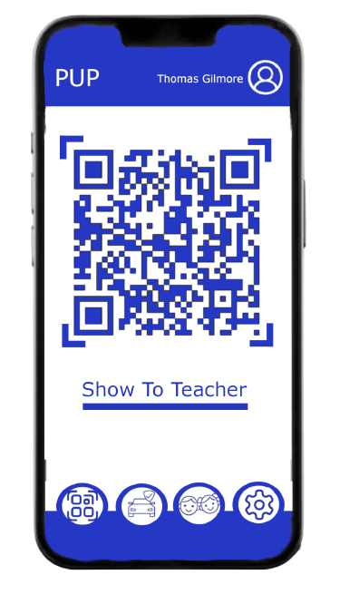

# This Page will contain all of the Mock Designs that we implement in order to keep a time line of the Designs we consider.

### This Design is for the QR Code for the Phone Application created by Thomas Gilmore in order to create an idea of what the parent would see once they requested for a QR Code

### This Design is for the Screen where the Parent would be selecting which student they would be picking up for that day. This desing allows us to gain a better understanding of what we should expect the parent to see along with allowing us to try and see what improvements we could make to the design and software.

